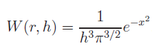
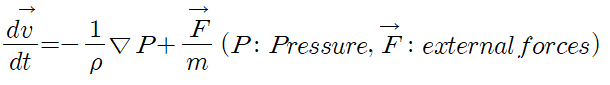
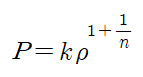
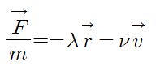
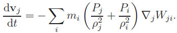

# vpython-projects
### Toy projects with `vpython` for computational physics
Check out details about vpython https://vpython.org/

## Basic Operation 

- Rotating the camera view: `ctrl + drag left mouse button` or `drag right mouse button`
- Zoom in and out: `scroll wheel` or `alt + drag left mouse button`
- Pan(move up, down, left, right): `shift + drag left mouse button`
- - -
## Mass Spring System

### Run `spring_network.py`
We implemented mass spring system, where each particles(masses) are connected with each other by spring.
We mainly considered 3 forces to calculate each particle acceleration.

- Spring force
- Gravity
- Damping force

Currently, only `box` objects(where particles can collide. In the above `gif` the green thing is comprised of 3 boxes) are supported. But in request I will update other object type such as sphere. (Try sphere! It is easy to implement collision detection algorithm than box object.)

You can also add or remove `box` objects inside the code. Check [line 157](https://github.com/sillsill777/vpython-projects/blob/f5e85b72786f599e6abd5749de5f3304dad52885/spring_network.py#L157) through [line 174](https://github.com/sillsill777/vpython-projects/blob/f5e85b72786f599e6abd5749de5f3304dad52885/spring_network.py#L174) in `spring_network.py`

## Simulating star with SPH(Smoothed Particle Hydrodynamics)

 &nbsp; &nbsp; &nbsp;
 &nbsp; &nbsp; &nbsp;

### Run `SPH.py`

You can find what SPH is, and details about SPH in this paper [Smoothed Particle Hydrodynamics](https://arxiv.org/abs/1007.1245v2).

And also consult [philip-mocz.medium](https://philip-mocz.medium.com/create-your-own-smoothed-particle-hydrodynamics-simulation-with-python-76e1cec505f1), which my code is heavily based on. 

So what SPH is basically doing is that using smoothing-kernel we can map continuous field on to a series of discrete particles. Smoothing-kernel is the approximation to dirac-delta function and there are many differnet kinds of kernel, in this example we use Gaussian smoothing kernel.

- Gaussian Smoothing Kernel
 

(where `x = r / h` )

- - -

And the fluid equation of motion which we want to discretize is `Euler equations` with the inviscid fluid, given as follow.

- Euler equations of motion in the case of inviscid fluid

- - -

With the SPH formalism, density at any given point can be easily approximated by particles comprising fluid. Details can be found at [Smoothed Particle Hydrodynamics](https://arxiv.org/abs/1007.1245v2).

- Density approximation using SPH

- - -

For the pressure, we assume pressure is given by polytropic equation of state. [Polytrope](https://en.wikipedia.org/wiki/Polytrope)

- Pressure 

where `k` is constant and `n` is polytropic index. (`n`=1 for our project) We can easily calculate pressure at any given point by calculating density at that point.

- - -

For the external force, we consider gravity and drag force.

- External Forces

First term corresponds to gravity and second to drag force. Second term is needed to make steady state.

- - -

Finally, we can write `Euler equation` with the help of SPH formalism as follow. (It is actually just re-expressing ` -(1/rho) * grad P ` in terms of SPH formalism.) 

 And we can calculate above equation with the `pressure`, `density`, `external forces` , `kernel` which we presented earlier.
 Using above equation, we can use `explicit Euler method` to calculate particles positions and velocity obeying `Euler equation`. Thus we can simulate fluid motion (or in this project, formation of the star) 
 
 - - -
 
## References
https://philip-mocz.medium.com/create-your-own-spring-network-simulation-with-python-d9246e4091e5

https://philip-mocz.medium.com/create-your-own-smoothed-particle-hydrodynamics-simulation-with-python-76e1cec505f1

[Smoothed Particle Hydrodynamics](https://arxiv.org/abs/1007.1245v2)

[Smoothed Particle Hydrodynamics: Theory,
Implementation, and Application to Toy Stars](https://pmocz.github.io/manuscripts/pmocz_sph.pdf)
